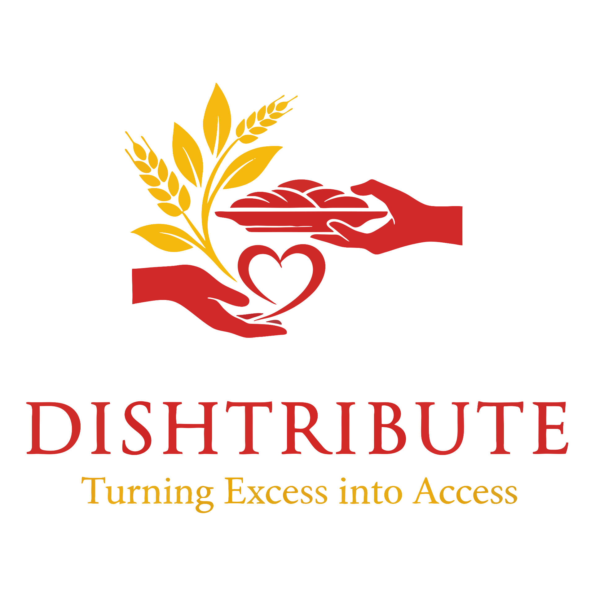

# 🍽️ Dishtribute – Turning Excess into Access

<p align="center">
  
</p>

<p align="center">
  <strong>A smart food donation platform connecting Donors, NGOs, Volunteers, and Admins to reduce food waste and feed people in need.</strong>
</p>

<p align="center">
  <a href="https://dishtribute.vercel.app/" target="_blank">
    
  </a>
  <a href="https://github.com/Shashikala-05/Dishtribute" target="_blank">
    
  </a>
</p>

---

## 🌐 Live Demo

👉 https://dishtribute.vercel.app/

---

## 📌 Project Overview

Dishtribute is a web application designed to reduce food waste by connecting food donors with NGOs and orphanages through volunteers.

The platform allows:

- 🍱 Donors to donate surplus food
- 🏢 NGOs / Orphanages to accept or reject food donations
- 🚚 Volunteers to collect and deliver food
- 👨‍💼 Admins to monitor and manage the complete system

---

## ✨ Features

### 🍱 Donor

- Register & Login
- Add food donations
- Upload food image
- Select pickup location
- View donation history
- Track donation status

### 🏢 NGO / Orphanage

- Register organization
- View available donations
- Accept or reject requests
- Track accepted donations

### 🚚 Volunteer

- View NGO-approved requests
- Accept pickup tasks
- Mark food as Picked
- Mark delivery as Completed

### 👨‍💼 Admin

- Monitor users
- Manage donations
- View dashboard statistics
- Track delivery progress

---

## 🔄 Workflow

```text
Donor
   │
   ▼
Add Food Donation
   │
   ▼
Pending
   │
   ▼
NGO Reviews
   │
 ┌─┴───────────┐
 │             │
Accept      Reject
 │
 ▼
Volunteer Assigned
 │
 ▼
Food Pickup
 │
 ▼
Food Delivered
```

---

## 🛠️ Tech Stack

### Frontend

- React.js
- TypeScript
- Vite
- Tailwind CSS
- shadcn/ui
- React Router

### Backend

- Supabase Authentication
- Supabase Database
- Supabase Storage

### Deployment

- Vercel

---

## 📂 Project Structure

```text
Dishtribute/
│
├── screenshots/
├── public/
├── src/
│   ├── components/
│   ├── contexts/
│   ├── pages/
│   ├── hooks/
│   ├── lib/
│   └── assets/
│
├── package.json
├── vite.config.ts
└── README.md
```

---

## 🚀 Installation

Clone the repository

```bash
git clone https://github.com/Shashikala-05/Dishtribute.git
```

Navigate into the project

```bash
cd Dishtribute
```

Install dependencies

```bash
npm install
```

Create a `.env` file

```env
VITE_SUPABASE_URL=YOUR_SUPABASE_URL
VITE_SUPABASE_ANON_KEY=YOUR_SUPABASE_ANON_KEY
```

Run locally

```bash
npm run dev
```

Build

```bash
npm run build
```

---

## 📸 Screenshots

### 🏠 Home Page


---

### 🔐 Login Page


---

### 🍱 Donor Dashboard


---

### 🏢 NGO Dashboard


---

### 🚚 Volunteer Dashboard


---

### 👨‍💼 Admin Dashboard


---

## 🔮 Future Enhancements

- Google Maps integration
- Live volunteer tracking
- AI-based NGO recommendation
- Push notifications
- QR Code verification
- Email notifications
- Food expiry prediction
- Mobile application

---

## ⭐ Support

If you like this project, consider giving it a ⭐ on GitHub!

---

## 📄 License

This project is developed for educational and portfolio purposes.
